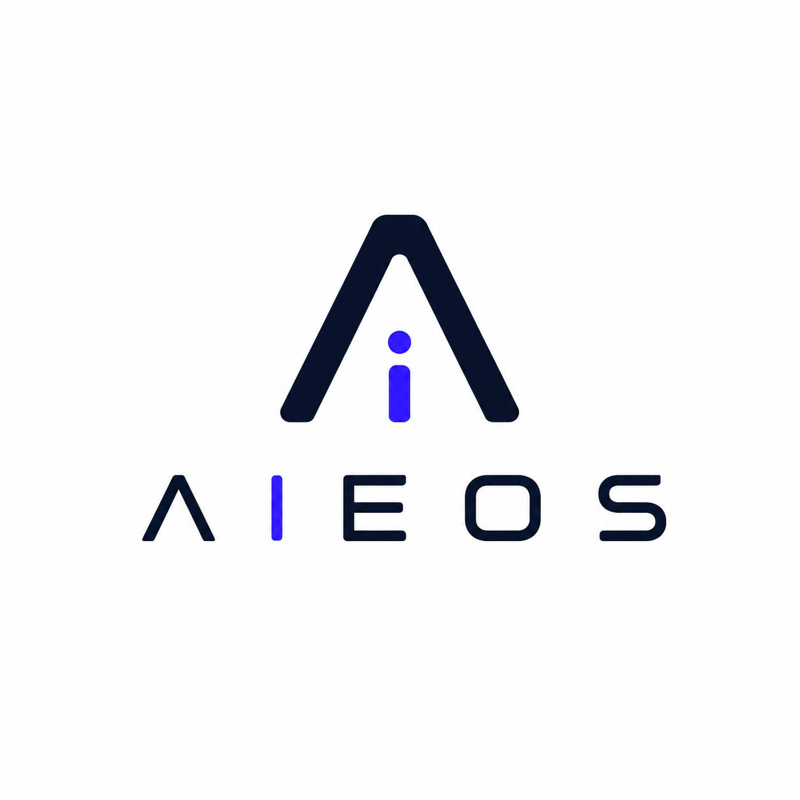

# AIEOS — AI Enterprise Operating System

<p align="center">
  
</p>

<p align="center">
  <b>Website:</b> <a href="https://soulfrosch2001.github.io/aieos/">soulfrosch2001.github.io/aieos</a>
  · <a href="site/">source</a>
</p>

> An open-source operating system for AI organizations. It hosts an unlimited number
> of independent AI companies inside Claude Code, each inheriting the same kernel,
> the same communication protocol, the same workflow engine, and the same memory
> architecture — so every company behaves like a real organization, not a pile of prompts.

AIEOS is to AI companies what Linux is to programs, Kubernetes is to services, and
Unreal Engine is to games: a **kernel** plus a **standard library** that everything
else inherits, extends, and overrides — never forks.

---

## Quick start (plain English)

AIEOS is a framework that makes Claude Code organize work like a real company: it
routes your request, plans it, runs several agents in parallel, checks quality, and
records what it learned.

You drive it with one command. For example:

```
/aieos review this function and suggest fixes
/aieos build a REST endpoint for user signup, with tests
```

Just describe what you want in plain language — AIEOS decides how big the job is, who
should handle it, and how to deliver it.

It turns on per the [install](#install): a one-time, machine-wide bootstrap makes
`/aieos` available in **every** project, no per-project setup.

Safety is built in: every decision is recorded append-only; secrets are auto-redacted
and dangerous content quarantined before anything is shared (see
[memory/ledger/README.md](memory/ledger/README.md)).

## The mental model

```
                 ┌─────────────────────────────────────────────┐
   LAW           │  kernel/laws         prime directives, tiers │  inherited by all
                 ├─────────────────────────────────────────────┤
   MECHANISM     │  kernel/contracts    base "classes"          │  what an entity IS
                 │  kernel/protocols    communication, 15-agent │  how entities act
                 │  kernel/loader       inheritance resolution  │  default ← override
                 │  kernel/registry     what is installed       │
                 ├─────────────────────────────────────────────┤
   STD LIBRARY   │  templates/  workflows/  councils/  memory/  │  free defaults
                 ├─────────────────────────────────────────────┤
   COORDINATION  │  government/         Supreme Orchestrator +  │  routes, never builds
                 │                      CEO CTO COO Auditor CIO  │
                 ├─────────────────────────────────────────────┤
   USERLAND      │  companies/          plugins: software, game,│  inherit everything
                 │                      tabletop, …             │
                 └─────────────────────────────────────────────┘
```

Knowledge flows **down** (enterprise → company → department → agent).
Decisions of consequence flow **up**. Companies never talk to each other directly —
all cross-company coordination goes through the **Government**.

## Repository map

| Path | Role |
|------|------|
| [kernel/](kernel/) | The OS core: contracts, protocols, laws, loader, registry. No company logic. |
| [government/](government/) | Supranational coordination. Routes work; never implements. |
| [templates/](templates/) | Base templates every company inherits (agent, council, workflow, …). |
| [workflows/](workflows/) | Reusable workflow library (feature, bug, hotfix, research, …). |
| [councils/](councils/) | Reusable council blueprints. |
| [memory/](memory/) | Enterprise memory + the hierarchical memory architecture. |
| [shared/](shared/) | Conventions, glossary, quality standards — cross-cutting. |
| [companies/](companies/) | Installed companies (plugins). |
| [docs/](docs/) | Architecture, design notes, how the OS explains itself. |
| [examples/](examples/) | Worked examples of building on AIEOS. |
| [tests/](tests/) | Conformance checks for the kernel contracts. |
| [roadmap/](roadmap/) | Where AIEOS is going. |

## Install

**Requirements:** Node.js >= 18 (the installer checks this for you).

### Option A — Native installer (recommended for most)

Download from the project's GitHub **Releases** page and run it — it installs AIEOS and
**auto-configures it while installing** (`npm install` + `npm run setup`), so `/aieos` is
ready in every project afterward.

- **Windows** — `AIEOS-Setup-<version>.exe`; uninstall from "Add/Remove Programs". See
  [installer/](installer/).
- **macOS** — `AIEOS-<version>.pkg` (installs to `/usr/local/aieos`); uninstall with
  `npm run teardown`. See [installer/macos/](installer/macos/).

### Option B — From source (developers)

1. **Clone or download AIEOS** and keep it in a stable location. The install bakes this
   path into the global command, so moving AIEOS later requires re-running `npm run setup`.
2. **`cd` into the AIEOS root** (the folder containing this README).
3. **Install dependencies:**

   ```sh
   npm install   # dependencies (e.g. neural TTS for audio summaries)
   ```

4. **Register AIEOS machine-wide:**

   ```sh
   npm run setup   # registers the global /aieos command for every project
   ```

`npm run setup` writes `~/.claude/commands/aieos.md` with this install's path baked in,
so you can type `/aieos <request>` inside **any** project to operate AIEOS there —
without copying AIEOS into it. In that support mode it creates a `resumo/` folder at the
host project's root and writes each decision's mandatory audio summary there (a PDF
report is optional).

In practice this means every new Claude Code session becomes AIEOS-aware — `/aieos`
is recognized everywhere without affecting projects you don't invoke it in. To turn
that off, run `npm run teardown` (details under **Uninstall / disable** below).

**Verify.** Check that `~/.claude/commands/aieos.md` exists and that `~/.claude/CLAUDE.md`
contains the `AIEOS:BEGIN`/`AIEOS:END` markers. Open a new Claude Code session to see
AIEOS active.

**Uninstall / disable.** Run `npm run teardown` to remove the global command and the
AIEOS block from `~/.claude/CLAUDE.md`. Alternatively, delete `~/.claude/commands/aieos.md`
manually and remove the `AIEOS:BEGIN`/`AIEOS:END` block from `~/.claude/CLAUDE.md`.

## Start here

1. [CLAUDE.md](CLAUDE.md) — operating instructions for Claude Code inside AIEOS.
2. [kernel/laws/prime-directives.md](kernel/laws/prime-directives.md) — the rules that override everything but a human.
3. [kernel/README.md](kernel/README.md) — how the kernel is put together.
4. [roadmap/ROADMAP.md](roadmap/ROADMAP.md) — the build plan.

## Status

Phase 1 — Foundation. The kernel core is being established. See
[CHANGELOG.md](CHANGELOG.md) and [roadmap/ROADMAP.md](roadmap/ROADMAP.md).

## License

[MIT](LICENSE). Contributions: [CONTRIBUTING.md](CONTRIBUTING.md).
